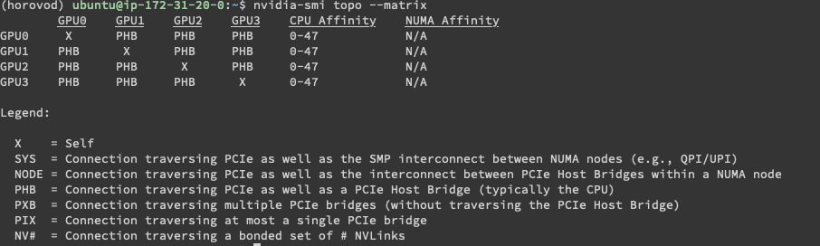
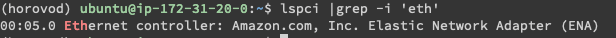
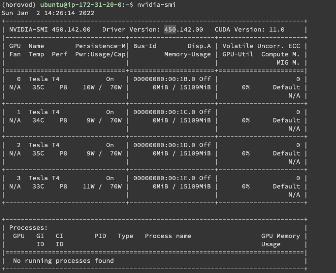

### 实验环境

|          |                                 |                    |
| -------- | ------------------------------- | ------------------ |
| 硬件环境 | 服务器数目                      | G4dn.12xlarge X  1 |
|          | 网卡型号、数目                  | ENA X 1            |
|          | GPU型号、数目                   | T4 X 4             |
|          | GPU连接方式                     | PCIe + MPI         |
| 软件环境 | OS版本                          | Ubuntu 18.04       |
|          | GPU driver、(opt. NIC driver)   | Nvidia-smi 450     |
|          | 深度学习框架 python包名称及版本 | PyTorch 15.0       |
|          | CUDA版本                        | CUDA 11.0          |
|          |                                 |                    |










### 实验结果

比较原始串行训练，用Horovod并行训练，加入压缩算法三者，在同样epoch条件下的训练时间和结果正确率。

Epoch size: 10 

|                    |              |                                                              |            |
| ------------------ | ------------ | ------------------------------------------------------------ | ---------- |
| 训练算法           |              | 训练时间                                                     | 结果正确率 |
| 串行训练           |              | real	2m22.338s<br/>user	3m10.260s<br/>sys	0m15.421s | 98.35%     |
| 用Horovod并行      | Device# == 2 | real	1m13.832s<br/>user	2m9.092s<br/>sys	0m28.114s  | 98.29%     |
|                    | Device# == 4 | real	0m51.258s<br/>user	3m37.314s<br/>sys	0m42.107s | 98.27%     |
| float8(8bit)压缩   | Device# == 2 | real	0m59.423s<br/>user	3m37.949s<br/>sys	0m29.238s | 9.58%      |
|                    | Device# == 4 | real	0m37.815s<br/>user	4m42.188s<br/>sys	0m44.879s | 9.58%      |
| float16(16bit)压缩 | Device# == 2 | real	0m58.941s<br/>user	3m11.445s<br/>sys	0m32.193s | 98.27%     |
|                    | Device# == 4 | real	0m38.347s<br/>user	4m21.195s<br/>sys	0m54.429s | 98.30%     |
|                    |              |                                                              |            |

## 


## Comment

1. install pytorch GPU version instead of pytorch cpu-only if your run on AWS g4dn.12xlarge with 4GPUs, otherwise cannot import horovod.torch as hvd

2. use `horovodrun -n 2 python3 pytorch_mnist_horovod.py` without `-hvd True`

3. I cannot understand why float16 with 4 devices has 98.29% accuracy

4. build horovod: https://github.com/horovod/horovod/blob/master/docs/contributors.rst

   ```
   pip uninstall -y horovod
   rm -rf build/ dist/
   HOROVOD_WITH_PYTORCH=1 HOROVOD_WITHOUT_TENSORFLOW=1 HOROVOD_WITHOUT_GLOO=1 HOROVOD_GPU_OPERATIONS=MPI  pip install -v -e .
   ```

   Make sure your OpenMPI built with CUDA: https://discuss.pytorch.org/t/segfault-using-cuda-with-openmpi/11140

   I download openmpi-4.1.2:

   ```
   wget https://download.open-mpi.org/release/open-mpi/v4.1/openmpi-4.1.2.tar.gz
   gunzip -c openmpi-4.1.2.tar.gz | tar xf -
   ```

5. Use `horovodrun` instead of `mpirun` for compressed version
6. For horovod 0.23 version, the allgather and async api are different from 0.19.4. I put edit one in ./Lab2/mpi_ops.py and ./Lab2/compression.py

