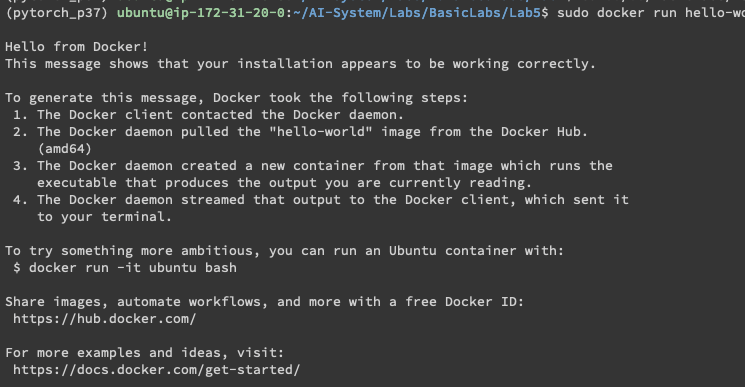
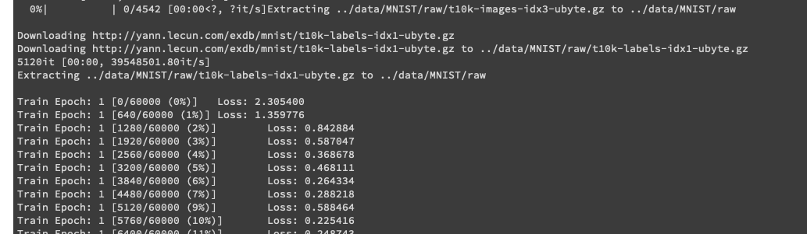
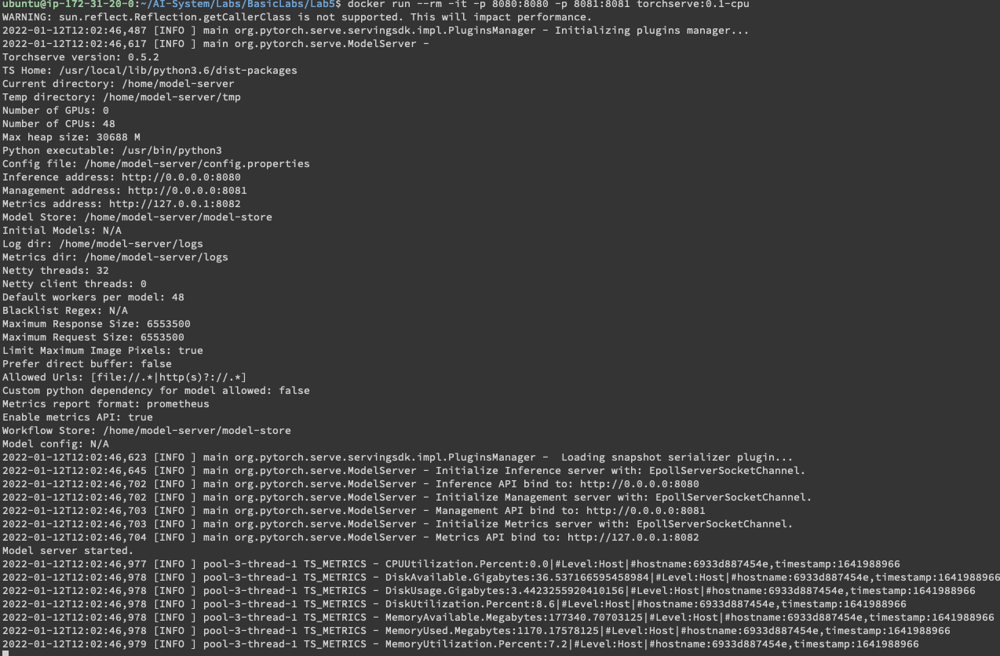
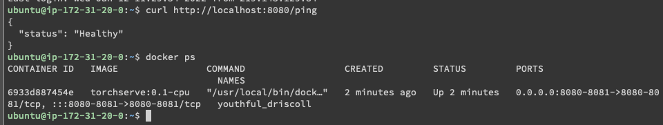
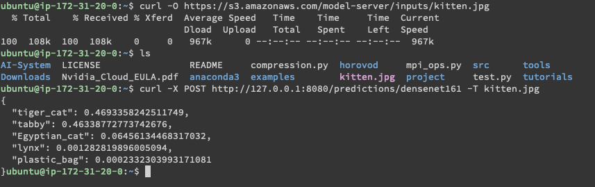

## 实验报告

### 实验环境

|          |                                 |              |
| -------- | ------------------------------- | ------------ |
| 硬件环境 | CPU（vCPU数目）                 | 24           |
|          | GPU(型号，数目)                 | T4X4         |
| 软件环境 | OS版本                          | Ubuntu 18.04 |
|          | 深度学习框架 python包名称及版本 | Pytorch_p37  |
|          | CUDA版本                        | 11.0         |
|          |                                 |              |

## Setup

### 实验结果

1. 使用Docker部署PyTorch MNIST 训练程序，以交互的方式在容器中运行训练程序。提交以下内容：
   1. 创建模型训练镜像，并提交Dockerfile
   2. 提交镜像构建成功的日志
   3. 启动训练程序，提交训练成功日志（例如：MNIST训练日志截图）

1. 使用Docker部署MNIST模型的推理服务，并进行推理。提交以下内容：
   1. 创建模型推理镜像，并提交Dockerfile
   2. 启动容器，访问TorchServe API，提交返回结果日志
   3. 使用训练好的模型，启动TorchServe，在新的终端中，使用一张图片进行推理服务。提交图片和推理程序返回结果截图。

## Comment

1. Solve "no space left": https://jhooq.com/docker-error-no-space-left/

