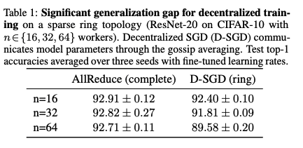

# Survey for the Impact of Network Topology on DSGD

Paper from:

Consensus Control for Decentralized Deep Learning
Decentralized gradient methods: does topology matter?

## Key point
- Train/test Performance
- 

### Consensus Control

Define a consensus distance: the average discrepancy between each node and the mean of model parameters over all machines. 

To prevent performance loss, this average discrepancy need to stays below a critical value (cratical consensus distance). 

For C-SGD, we can regard in every step, the consensus distance is 0, which is sufficient but not neccessary. For D-SGD, if we make consensus distance less than the critical value every step, then D-SGD can recover the convergence rate of C-SGD.

Summary: the train/test performance of D-SGD depends on the consensus distance, especially in the intial training phase (0- ~300 epochs). Large consensus distance cause performance degradation.
 
### Topology Matter?
In theory, convergence rate should be faster in more connected topology; however, in experiments, they are similar.
In terms of wall-clock time, convergence is faster for sparser topology due to smaller communication load. 

And some previous experimental results show: **D-SGD achieve similar performance after the same number of iterations/epochs on topologies as different as rings and cliques**. One explanation is , when the # of iterations is large enough, the convergence rate is topology-independent.

When the dataset is non-i.i.d, the topology matters!!! (well, well, of course it matters.) This will affect the final performance.

Summary: Under homogeneous conditions (data, network, devices), convergence rate is topology insensitive and sparser topology can be faster to converge in wall-clock due to smaller communication load. But if there exists data heterogeneity, topology will affect the final training/test performance, which is important for cross-silo federated learning. 
## Comments
1. Performance gap when increasing the #node for D-SGD

