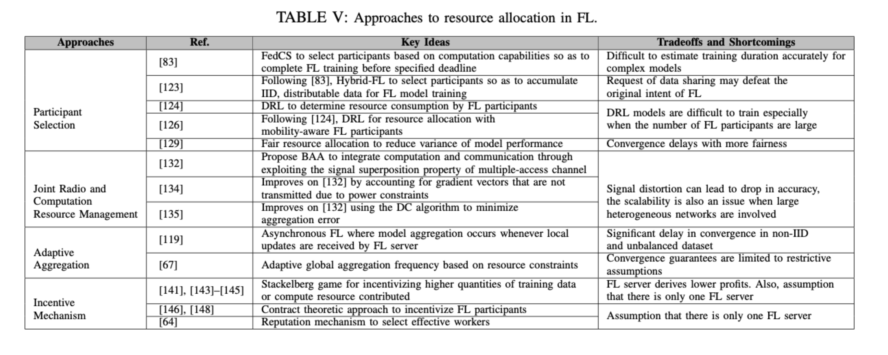

## Summary

### Issues

#### Statistical challenges

#### Communication costs

#### Resource allocation

- Participant Selection
  - Avoid straggler
  - Heterogeneity: energy, willingness to participate, quality of data, communicaiton and computation
  - RL is used in selecting partitionment 
  - Fairness for selection (the variance of performance of an FL model across participants)
- Joint Radio and Computation Resource management
- Adaptive Aggregation
  - FedAvg: synchronous method, susceptible to the straggler effect
  - Asynchronous model is proposed to improve the scalability and efficiency of FL
  - Empirically effective but convergence is slow
- Incentive Mechanism
  - Incentivize participation 
  - Reduce the potential adverse impacts of information asymmetry
- 

#### Privacy and security

##### Privacy

- Differential privacy-based protection solutions

- Collaborative training solutions
- Encryption-based Solutions

##### Security

Malicious Participant

- Data poisoning Attacks
- Model Poisoning Attacks
- Free-Riding Attacks

#### Applications of Federated Learning for Mobile Edge Computing

- Cyberattack Detection: cyberattack detection models can be learned collaboratively while meataining user privacy
- Edge Caching and Computation Offloading: an optimal caching and computation offloading scheme can be collaboratively learned and optimized with FL
- Base Station Association: ? Optimize base station association so as to limit interference faced by users
- Vehicular Networks: traffic queue length prediction and energy demand in electtric vehicle charging stations 

### Characteristics

- Slow and unstable communication
- Heterogeneous Devices
- Privacy and security Concerns

### Method

- Increase computation
- Model Compression (need more reading)
- Importance-based Updating

## Reading List

- HierFAVG
- RL for resource management:  https://arxiv.org/pdf/1812.03633.pdf
- 

## Ideas

multimodel with Federated Learning: focus on heterogeneous data

Knowledge Generation

## Writing

1. Firstly, data owners are **increasingly privacy sensitive**. 
2. Following privacy concerns among consumers in the age of big data, policy makers have responded with the implementation of **data privacy legislations** such as the **European Commission's General Data Protection Regulation (GDPR)** and **Consumer Privacy Bill of Rights** in the US.
3. Secondly, a cloud-centric approach **involves** long propagation delays and **incurs unacceptable** latency for applications in which real-time decisions have to be made, e.g., in self-driving car systems.
4. Thirdly, the transfer of data to the cloud for processing **burdens the backbone networks** especially in tasks involving unstructured data, e.g., in video analytics. 
5. The implementation of FL at mobile edge networks can thus naturally **leverage on the increasing computing power and wealth of data** collected by distributed end devices, **both of which are driving forces** contributing to the rise of DL.
6. This **deterioration in accuracy** is further shown to be quantified by the earth mover's distance (EMD), i.e., difference in FL participant's data distribution as compared to the population distribution.
7. The authors in [72] also find that **global imbalance,** i.e., the situation in which the collection of data held across all FL participants is **class imbalanced**, **leads to a** deterioration **in model accuracy**.

