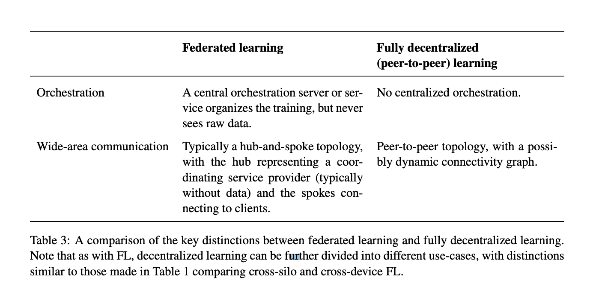

# Advances and Open Problems in Federated Learning

## Concept

Cross-silo federated learning: clients are different organizations (e.g. medical or financial)

Communication is a typically a hub-and-spoke topology

Feature partitioning: same custom but different feature (finacial and health)

#### A Typical Federated Training Process

Client selection (check available) -> Broadcast (download model) -> Client computation (SGD) -> Aggregation (stragglers may be dropped; secure aggregation...) -> Model update

 #### Fully Decentralized / P2P Distributed Learning

Reason: a reliable and powerful cetral server may not always be availabe or desirable; this server can also become a bottleneck when # clients are large.

Fully decentralized SGD; directed networks has been studied in [29, 226]

**BUT**, a central authority may still exsit in this seeting to decide the model/algorithm. Alternatively, collaboratively through a consensus scheme can be decide.

 

Comment: Interesting topic, but is it practical? Is it important? At least, from my thought, most of FL need a central orchestration server. The benefit should be carefully check. Another point is, we really has a decentralized testbed.

Answer: In practice, a blockchain is a distributed ledger and sutiable for this settings. The challenge is the transmission data are public and secure aggregation [80] and confidential smart contract [119] may suitable solutions.**Another Fully decentralized FL can be Cross-Silo Federated Learning**

#### Split Learning

> Split Learning: split the execution of a model on a per-layer basis between the clients and the server. The outputs at the cut layer is smashed data/

NoPeek SplitNN [462] reduces the potential leakage via communicated activations, by reducing their distance correlation with the raw data.

## Reading List

MATCHA [469]

Bonawtiz et al. [80]

Federated transfer learning [490]

Compare communication requirements of SL and FL [421]

Multimodel : 

