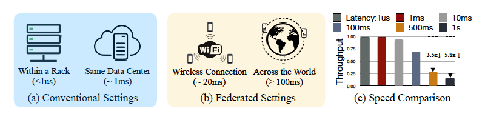

# Delayed Gradient Averaging: Tolerate the Communiaiton Latency in Federated Learning

## Problem and Motivation

Area: Federated Learning

Problem: avoid high latency during Federated Learning across the world

Motivation:  Unlike data center with high bandwidth and low latency network, edge devices are usually connectred through wireless and long-distance connection, thus the bandwidth and latency are strictly limited. Then authors use a picture to show how it affects the throughput.

It also gives the reasons why there are often high latency:

> On the one hand, the high-density urban office and home environments create ta lot of contention, as dozens of devices compete for the same radio frequency. On the other hand, the multi-geographic located data entails a minimum latency cost: even with the speed of light, it requires hundreds of miliseconds to send a packet across the world

Multiple devices compete for  communication resources; too far across the world

## Method

> The key idea is to delay the gradient averaging to a future iteration thus the communication can be pipelined with computation.

## Experiments

## Reviewer Comments

## Writing

## My Comments

#### What I can Learn

#### Which part could be improved

#### Future directions

