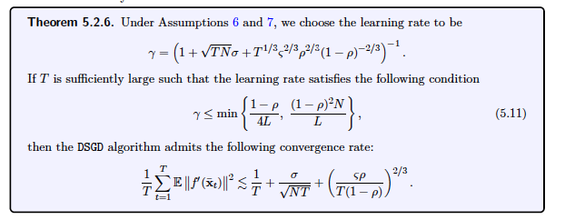

## System Relaxation 3: Decentralized Communication

> AllReduce and multi-server parameter server have an O(N) dependency on the netwk latency. The fundamental reason for this is that all these approaches insist that the information on each worker be propageted to ALL other workers in a single round of communication.

AllReduce: reduce the values and distribute the results to all processes 

**There are multiple ways to get rid of latency bottleneck, e.g. using a textbook reduction tree**

Comment: why not compared different methods? Is the decentralized communication the best one in reducing latency?

Decentralized communication adopts a logical ring among N workers, and every worker only sends message to its two neighbors. That can reduce the latency overhead to O(1) but at the cost of convergency rate.

### Impact

- AllReduce or multi-server parameter server:
  $$
  2(N-1)t_{latency} + 2\frac{N-1}{N}t_{transfer}
  $$

- Decentralized Communication:
  $$
  2t_{latency} + 2t_{transfer}
  $$
  

**Comment**: The impact of factor $(N-1)/N$ will decrease  when the N becomes larger. But if the bandwidth is very high and latency is much less (data center), AllReduce and multi-server parameter server may be more suitable.

### Theoretical Analysis

> A differentiable function ff is said to have an L-Lipschitz continuous gradient if for some L>0
>
>  ‖∇f(x)−∇f(y)‖≤L‖x−y‖, ∀x,y.
>
> **Note:** The definition doesn’t assume convexity of f.

From: https://xingyuzhou.org/blog/notes/Lipschitz-gradient

Eigenvector:

> In [linear algebra](https://en.wikipedia.org/wiki/Linear_algebra), an **eigenvector** ([/ˈaɪɡənˌvɛktər/](https://en.wikipedia.org/wiki/Help:IPA/English)) or **characteristic vector** of a [linear transformation](https://en.wikipedia.org/wiki/Linear_map) is a nonzero [vector](https://en.wikipedia.org/wiki/Vector_space) that changes at most by a [scalar](https://en.wikipedia.org/wiki/Scalar_(mathematics)) factor when that linear transformation is applied to it. The corresponding **eigenvalue**, often denoted by {\displaystyle \lambda }, is the factor by which the eigenvector is scaled.

**All local model fater t steps will converge to the average model **

- If the communication network is fully connected, the convergence rate is consistent with mb-SGD since the last term becomes zero.
- As long as T is sufficiently large, then the last term will be dominated by the second term. Then the linear speedup can be achieved.